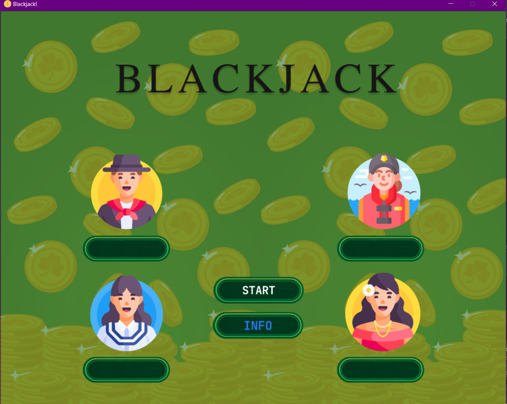
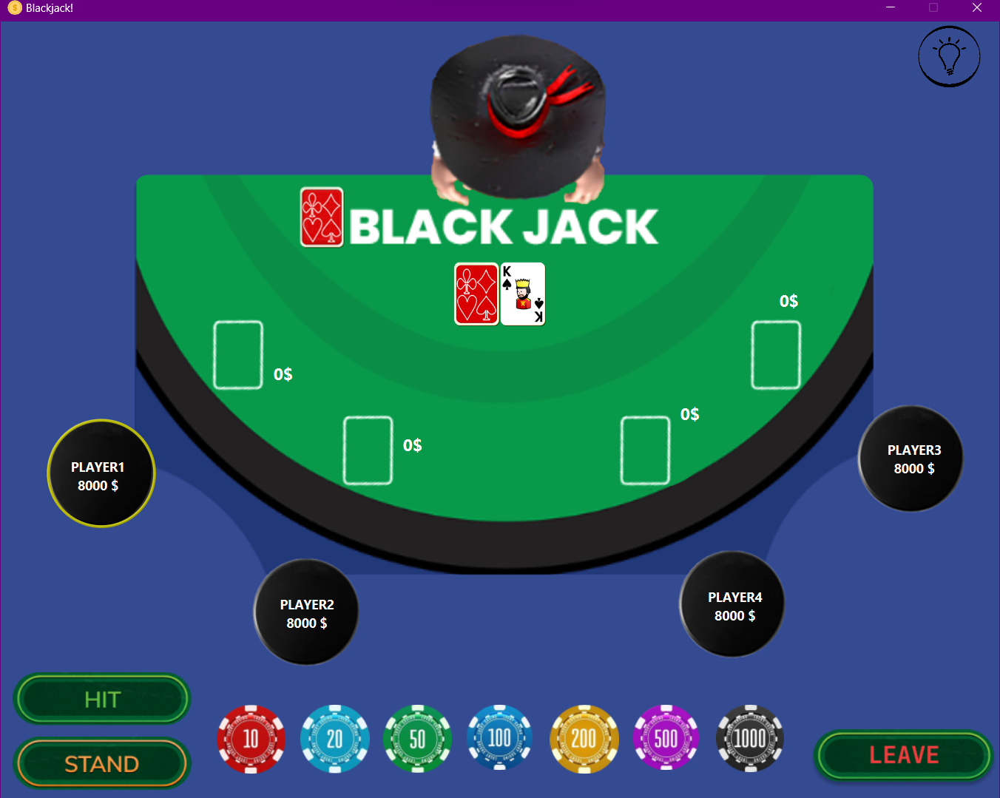
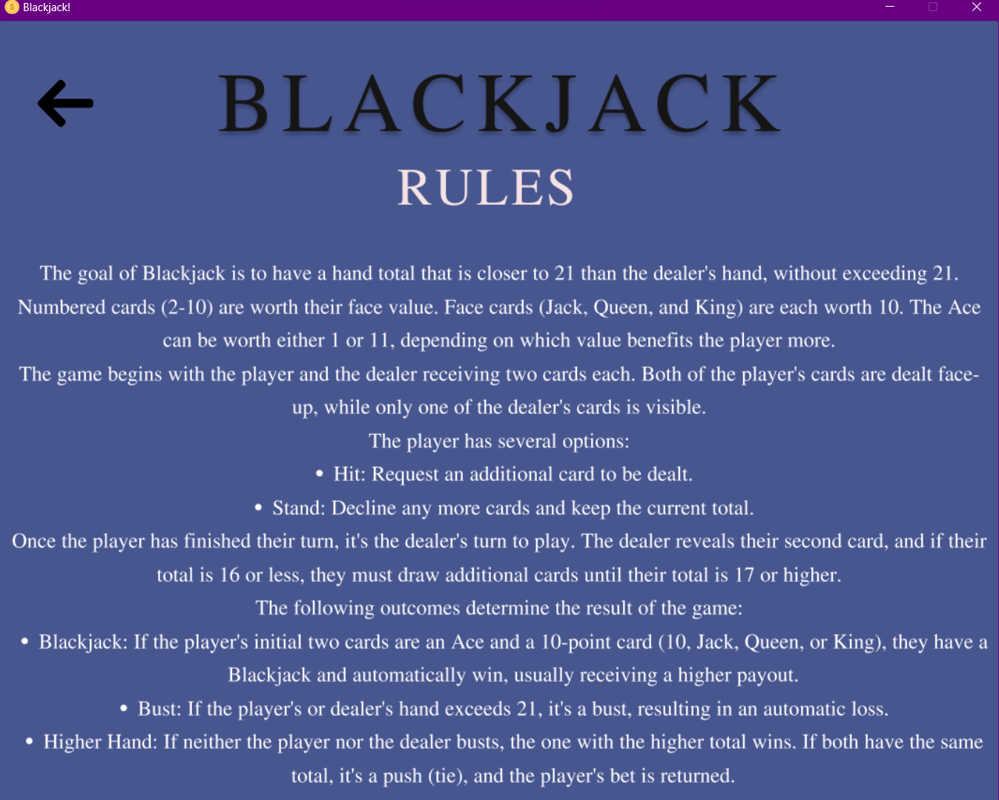

# Blackjack
Welcome to the Blackjack Game! This is a multiplayer version of the popular casino card game, designed for four players. In this game, you will have the opportunity to test your luck and skills in the ultimate battle against the dealer.

## How to play
1. Start the game by running the 'App.java' file.
2. Upon starting the game, players are prompted to enter their names.
3. The objective of the game is to obtain a hand value equal to or as close to 21 points without exceeding it.
4. Before the dealing begins, each player has 10 seconds to choose the amount they want to bet for the round.
5. Players are dealt two cards each, while the dealer receives one face-down card and one face-up card.
6. The numerical cards from 2 to 10 are worth their face value, an ace is worth 11 points, and face cards (jack, queen, king) are worth 10 points.
7. A player has the option to draw additional cards if their hand value is less than 21.
8. If a player's hand value exceeds 21, they lose the round.
9. The dealer must draw cards if their hand value is less than 16 points. Each additional card drawn by the dealer remains face-down until the end of the players' turns.
10. A player wins if their hand value is closer to 21 than the dealer's without exceeding 21. In case of a tie, the bet is returned to the players.
11. In the event of a win, the player receives double the value of their bet. If the player loses, they lose the amount they bet.

## Technologies Used
- Java - the programming language used for the application.
- JavaFX - a framework for creating graphical user interfaces in Java.
- XML - used for defining the user interface layout in JavaFX.
- Git - version control system for managing the project codebase.

## Usage
1. Launch the application by running the App class.
2. Enter your names.
3. Follow the on-screen instructions to play the game.
4. Place your bets and make strategic decisions to beat the dealer.
5. Enjoy the excitement of playing Blackjack!

## Screenshots
### 1. Starter screen
   
### 2. Gameplay screen
   
### 3. Info screen
   

## Have fun playing Blackjack and may the odds be in your favor!
